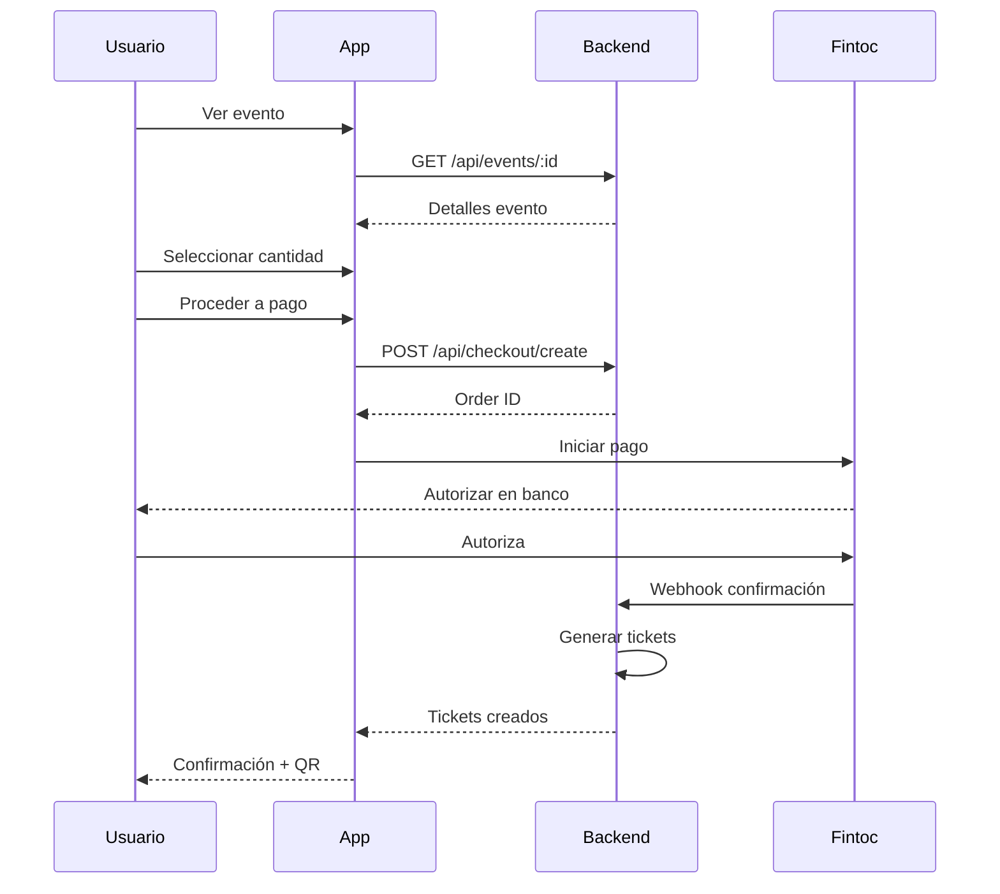
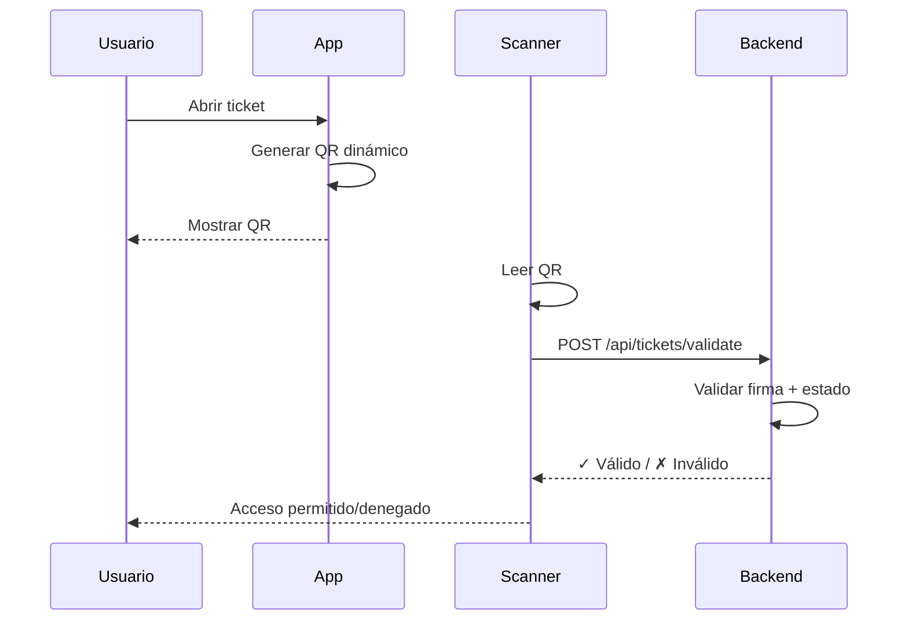

# Especificaciones Técnicas - KET MVP

## Tabla de Contenidos

1. [Arquitectura General](#arquitectura-general)
2. [Módulos del Sistema](#módulos-del-sistema)
3. [Integraciones](#integraciones)
4. [Seguridad y Anti-Fraude](#seguridad-y-anti-fraude)
5. [Flujos de Usuario](#flujos-de-usuario)
6. [Modelos de Datos](#modelos-de-datos)
7. [APIs y Endpoints](#apis-y-endpoints)
8. [Requisitos No Funcionales](#requisitos-no-funcionales)

---

## Arquitectura General

### Stack Tecnológico

#### Frontend
- **Framework**: Next.js 14+ (App Router)
- **UI Library**: React 18+
- **Styling**: TailwindCSS
- **State Management**: Zustand / React Context
- **HTTP Client**: Axios / Fetch API
- **Forms**: React Hook Form + Zod
- **PWA**: next-pwa para funcionalidad offline

#### Backend (Microservicios)
- **Runtime**: Node.js 20+
- **Framework**: Express.js / Fastify
- **Database**: PostgreSQL (principal) + Redis (caché)
- **ORM**: Prisma
- **Authentication**: NextAuth.js / OAuth 2.0
- **Queue**: Bull / BullMQ para procesamiento asíncrono
- **Storage**: AWS S3 / Cloudinary (imágenes)

#### Infraestructura
- **Hosting**: Vercel (frontend) + AWS/Railway (backend)
- **CI/CD**: GitHub Actions
- **Monitoring**: Sentry + LogRocket
- **Analytics**: Mixpanel / Amplitude

---

## Módulos del Sistema

### 1. Autenticación y Usuarios

#### Funcionalidades
- Registro con email + celular
- Social login (Google, Apple)
- Verificación 2FA (SMS)
- Gestión de perfil

#### Endpoints
```
POST   /api/auth/register
POST   /api/auth/login
POST   /api/auth/logout
GET    /api/auth/me
PUT    /api/users/:id
DELETE /api/users/:id
```

#### Modelo de Datos
```typescript
interface User {
  id: string
  email: string
  phone: string
  firstName: string
  lastName: string
  avatar?: string
  spotifyConnected: boolean
  appleMusicConnected: boolean
  createdAt: Date
  updatedAt: Date
}
```

---

### 2. Integración Musical (Spotify/Apple Music)

#### Spotify OAuth 2.0 + PKCE

**Flow:**
1. Cliente genera `code_verifier` y `code_challenge`
2. Redirect a Spotify con `code_challenge`
3. Callback con `authorization_code`
4. Exchange por `access_token` con `code_verifier`
5. Almacenar tokens (refresh token en DB)

**Endpoints:**
```
GET  /api/integrations/spotify/authorize
GET  /api/integrations/spotify/callback
POST /api/integrations/spotify/disconnect
GET  /api/integrations/spotify/top-artists
GET  /api/integrations/spotify/recommendations
```

**Scopes Requeridos:**
- `user-top-read`
- `user-follow-read`
- `user-read-recently-played`

#### Apple Music OAuth

**Endpoints:**
```
GET  /api/integrations/apple-music/authorize
GET  /api/integrations/apple-music/callback
POST /api/integrations/apple-music/disconnect
```

---

### 3. Descubrimiento de Eventos

#### Funcionalidades
- Feed personalizado basado en gustos musicales
- Seguir venues, artistas, amigos
- Ver qué eventos asistirán tus amigos
- Filtros por fecha, ubicación, género

#### Endpoints
```
GET  /api/events
GET  /api/events/:id
GET  /api/events/recommended
GET  /api/events/following
POST /api/events/:id/follow
POST /api/events/:id/share
```

#### Modelo de Datos
```typescript
interface Event {
  id: string
  title: string
  description: string
  venue: Venue
  artist: Artist
  date: Date
  doors: Date
  price: number
  currency: 'CLP'
  totalTickets: number
  availableTickets: number
  images: string[]
  genres: string[]
  status: 'upcoming' | 'on-sale' | 'sold-out' | 'cancelled'
  createdAt: Date
}

interface Venue {
  id: string
  name: string
  address: string
  city: string
  capacity: number
  coordinates: { lat: number; lng: number }
}

interface Artist {
  id: string
  name: string
  spotifyId?: string
  appleMusicId?: string
  genres: string[]
  image?: string
}
```

---

### 4. Checkout y Pagos

#### Flow de Compra
1. Usuario selecciona evento y cantidad
2. Revisión de orden (precio transparente, sin cargos ocultos)
3. Pago con Fintoc (A2A) o tarjeta (fallback)
4. Confirmación y generación de tickets

#### Fintoc Integration

**Endpoints:**
```
POST /api/payments/fintoc/initiate
POST /api/payments/fintoc/confirm
POST /api/payments/fintoc/webhook
GET  /api/payments/:id/status
```

**Flow:**
```javascript
// 1. Iniciar pago
const payment = await fintoc.payments.create({
  amount: total,
  currency: 'CLP',
  recipient_account: VENUE_ACCOUNT,
  metadata: {
    order_id: order.id,
    event_id: event.id
  }
})

// 2. Usuario autoriza en su banco
// 3. Webhook confirma pago
// 4. Generar tickets
```

#### Stripe/Mercado Pago (Fallback)

**Endpoints:**
```
POST /api/payments/card/intent
POST /api/payments/card/confirm
```

#### Modelo de Datos
```typescript
interface Order {
  id: string
  userId: string
  eventId: string
  quantity: number
  unitPrice: number
  total: number
  currency: 'CLP'
  paymentMethod: 'fintoc' | 'card'
  paymentStatus: 'pending' | 'completed' | 'failed' | 'refunded'
  tickets: Ticket[]
  createdAt: Date
}

interface Payment {
  id: string
  orderId: string
  provider: 'fintoc' | 'stripe' | 'mercadopago'
  providerId: string
  amount: number
  status: 'pending' | 'completed' | 'failed'
  metadata: Record<string, any>
}
```

---

### 5. Sistema de QR Dinámico

#### Generación de QR

**Características:**
- Token efímero con TTL (Time To Live)
- Activación solo el día del evento
- Firma criptográfica (HMAC-SHA256)
- Rotación cada N minutos

**Algoritmo:**
```javascript
function generateDynamicQR(ticket) {
  const payload = {
    ticket_id: ticket.id,
    user_id: ticket.userId,
    event_id: ticket.eventId,
    timestamp: Date.now(),
    expires_at: Date.now() + (5 * 60 * 1000) // 5 min
  }

  const signature = hmac('sha256', SECRET_KEY, JSON.stringify(payload))

  const qrData = {
    ...payload,
    signature
  }

  return Buffer.from(JSON.stringify(qrData)).toString('base64')
}
```

#### Validación de QR

**Endpoints:**
```
POST /api/tickets/validate
GET  /api/tickets/:id/qr
POST /api/tickets/:id/revoke
```

**Validación Offline:**
- App de acceso descarga lista de tickets válidos al inicio del día
- Validación local con firma
- Sync periódica con backend
- Lista de revocación para tickets transferidos/cancelados

**Modelo de Datos:**
```typescript
interface Ticket {
  id: string
  orderId: string
  userId: string
  eventId: string
  qrCode: string
  status: 'active' | 'used' | 'transferred' | 'cancelled'
  activatedAt?: Date
  scannedAt?: Date
  transferHistory: Transfer[]
}

interface Transfer {
  id: string
  ticketId: string
  fromUserId: string
  toUserId: string
  transferredAt: Date
}
```

---

### 6. Transferencias de Tickets

#### Flow
1. Usuario selecciona ticket → "Enviar a amigo"
2. Ingresa email/teléfono del receptor
3. Receptor recibe notificación
4. Receptor acepta transferencia
5. Ownership cambia (trail auditable)
6. QR anterior se revoca, se genera nuevo QR

#### Endpoints
```
POST /api/tickets/:id/transfer
POST /api/tickets/transfer/:transferId/accept
POST /api/tickets/transfer/:transferId/reject
GET  /api/tickets/:id/transfer-history
```

---

### 7. Waitlist y Reventa Controlada

#### Waitlist (Sold Out)

**Flow:**
1. Evento agotado → usuario se une a waitlist
2. Otro usuario devuelve ticket
3. Sistema notifica a waitlist (FIFO)
4. Primer usuario tiene 15 min para comprar
5. Si no compra, pasa al siguiente

**Endpoints:**
```
POST /api/events/:id/waitlist/join
POST /api/tickets/:id/return
GET  /api/users/me/waitlist
```

#### Reventa Face Value

- Precio máximo = precio original
- Comisión plataforma: 5-10%
- Sin reventa externa permitida
- KYC opcional para montos altos

---

### 8. Billetera Interna

#### Funcionalidades
- Saldo en cuenta
- Créditos promocionales
- Historial de transacciones
- Recarga con Fintoc
- Retiro a cuenta bancaria

#### Endpoints
```
GET  /api/wallet/balance
POST /api/wallet/deposit
POST /api/wallet/withdraw
GET  /api/wallet/transactions
```

---

### 9. Panel de Productores (B2B)

#### Funcionalidades
- Creación de eventos
- Gestión de inventario (zonas, seating)
- Analytics en tiempo real
- Reportes de ventas
- Conciliación con Fintoc
- Lista de invitados
- Preventas con registro previo

#### Endpoints
```
POST   /api/producer/events
PUT    /api/producer/events/:id
GET    /api/producer/events/:id/analytics
GET    /api/producer/events/:id/sales
POST   /api/producer/events/:id/guest-list
GET    /api/producer/reports/reconciliation
```

---

## Seguridad y Anti-Fraude

### Medidas de Seguridad

#### 1. Rate Limiting
```javascript
// Express middleware
const rateLimit = require('express-rate-limit')

const checkoutLimiter = rateLimit({
  windowMs: 15 * 60 * 1000, // 15 min
  max: 5, // 5 intentos por IP
  message: 'Demasiados intentos de compra'
})

app.use('/api/checkout', checkoutLimiter)
```

#### 2. Device Fingerprint
- Recolectar: User-Agent, IP, Canvas fingerprint, Screen resolution
- Detectar múltiples cuentas desde mismo dispositivo

#### 3. Anti-Bot
- Google reCAPTCHA v3 en checkout
- Detección de comportamiento humano (mouse movements, timing)

#### 4. Límites por Usuario
- Max 4 tickets por evento por usuario
- Max 2 órdenes por evento por dispositivo
- Verificación de celular para compras >$100.000 CLP

#### 5. Machine Learning Anti-Scalping
```python
# Features para modelo ML
features = [
  'tiempo_desde_registro',
  'num_compras_24h',
  'num_dispositivos',
  'patron_navegacion',
  'velocidad_checkout',
  'num_eventos_mismo_dia'
]

# Modelo de clasificación
modelo.predict(features) # -> probabilidad de scalping
```

---

## Flujos de Usuario

### Flow 1: Compra de Ticket



### Flow 2: Acceso al Evento



---

## Requisitos No Funcionales

### Performance
- **Tiempo de carga inicial**: < 2s
- **Tiempo de checkout**: < 5s
- **Validación de QR**: < 300ms
- **API response time**: p95 < 200ms

### Escalabilidad
- Soportar 10,000 usuarios concurrentes
- 1,000 checkouts por minuto
- 100 eventos simultáneos en venta

### Disponibilidad
- **Uptime**: 99.9% (SLA)
- Tolerancia a caídas de servicios de pago
- Modo offline para validación de QR

### Seguridad
- HTTPS obligatorio (TLS 1.3)
- Cifrado en reposo (AES-256)
- Rotación de claves cada 90 días
- Logs inmutables (audit trail)
- Pruebas de penetración trimestrales

---

## Cumplimiento Legal (Ley 21.719)

### Privacy-by-Design

#### Minimización de Datos
Solo recolectar:
- Email, teléfono, nombre (registro)
- Datos musicales (si usuario conecta Spotify/Apple)
- Datos de pago (procesados por Fintoc, no almacenados)

#### Consent Flows
```javascript
const consents = {
  essential: true, // Cookies técnicas
  analytics: false, // Requiere opt-in
  marketing: false, // Requiere opt-in
  spotify: false, // Requiere opt-in explícito
  appleMusic: false // Requiere opt-in explícito
}
```

#### Derechos del Usuario
- **Acceso**: Descargar todos sus datos
- **Rectificación**: Editar perfil
- **Eliminación**: Borrar cuenta (+ anonimizar compras pasadas)
- **Portabilidad**: Exportar en JSON/CSV
- **Oposición**: Opt-out de marketing

---

## Próximos Pasos

1. **Diseño UX/UI**: Wireframes y mockups en Figma
2. **Setup Proyecto**: Inicializar Next.js + Prisma + PostgreSQL
3. **Integraciones**: Spotify OAuth + Fintoc sandbox
4. **MVP Core**: Auth + Discovery + Checkout + QR
5. **Testing**: Evento piloto con 100-500 asistentes

---

**Documento versión 1.0**
**Última actualización**: Diciembre 2024

Generado con [Claude Code](https://claude.com/claude-code)
